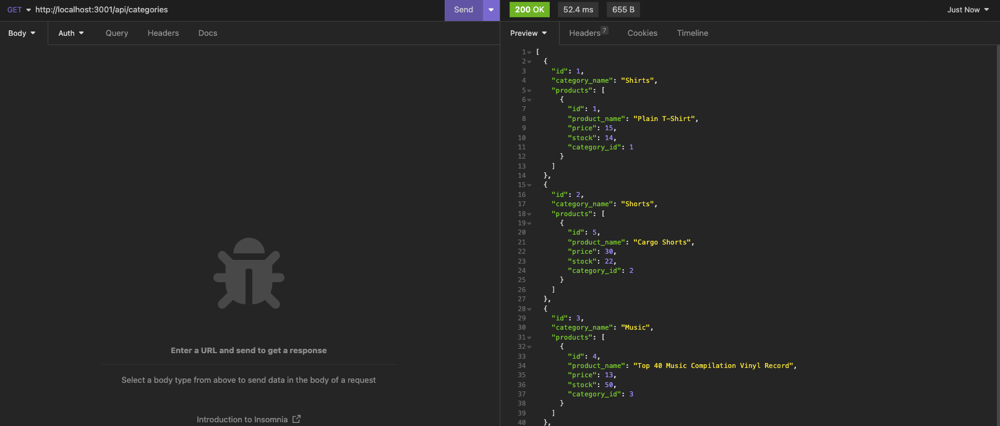

# E-commerce_Back_End-ch13

This project uses the following technologies:

- Node.js
- Express.js
- MySQL
- Sequelize ORM
- dotenv package
- console.table package

## Description

This project is a back-end application for an e-commerce site, built using Express.js and MySQL. It utilizes Sequelize to interact with the database and allows users to perform CRUD operations on various models, including products, categories, and tags. The project also includes a walkthrough video to demonstrate its functionality.

## Table of Contents

- [Installation](#installation)
- [Usage](#usage)
- [Credits](#credits)
- [Features](#features)

## Installation

To install this project, please follow these steps:

1. `Clone the repository to your local machine.`

2. `Ensure that you have Node.js, MySQL2, and Sequelize installed.`

3. `Open the terminal and navigate to the cloned repository.`

4. `Run "npm install" command to install the required dependencies.`

5. `Create a .env file in the root directory of the application and add your MySQL username, password, and database name as environment variables.`

6. `Run the schema.sql file in the db folder to create the database and tables.`

7. `Run "npm run seed" command to seed the database with test data.`

8. `Run "npm start" command in the terminal to start the application.`

- Review the code on the GitHub repository by visiting the [GitHub Repository](https://github.com/etapm/E-commerce_Back_End-ch13). You can also view the walkthrough video here: [E-commerce Back-end Walkthrough Video](https://drive.google.com/file/d/1OGQ0nHx1sAE8Y0j-hcOW_AznAAYS3KhQ/view)

## Dependencies

- dotenv
- express
- mysql2
- sequelize

You can install them by running `npm install` in your project directory, which will read the `package.json` file and install all the necessary dependencies.

## Usage

1.  Install Node.js and MySQL on your local machine.

2.  Clone the repository to your machine.

3.  Open a terminal window and navigate to the project directory.

4.  Run the command npm install to install the necessary dependencies.

5.  Create a .env file in the root directory of the project.

6.  Add the following environment variables to the .env file:

        - DB_USER= your MySQL username
        - DB_PW= your MySQL password
        - DB_NAME= your database name

7.  Run the following commands in the terminal to create the database schema and seed it with test data:

         npm run schema
         npm run seed

8.  Start the server by running the command npm start in the terminal.

9.  Use a tool like Insomnia to test the application by performing GET, POST, PUT, and DELETE requests on the available API routes.

    

10. You should be able to view data for categories, products, and tags in JSON format and successfully create, update, and delete data in the database.

## Credits

N/A

## License

N/A

## Badges

N/A

## Features

N/A

## How to Contribute

N/A

## Tests

N/A
